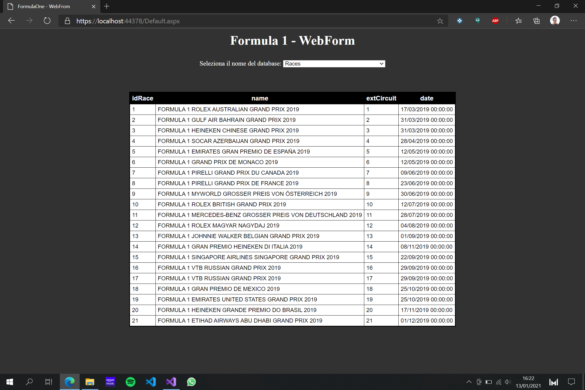

# FORMULA ONE SOLUTION
#### Autore: Chopra Deepak

## Descrizione
La soluzione comprende 3 progetti:
* Progetto Console, in cui ci occupa della gestione delle operazioni sul database
## Img Esempio

* Progetto DLL, contenente le varie classi che vengono utilizzate dagli altri progetti
* Progetto WebForm, in cui viene programmata la parte web con l'utilizzo di ASP.net

## Software neccesari:
* Visual Studio
* Pacchetti dei vari applicativi, come quello di SqlClient, ASP.net ad esempio

## Team work
> Invece si utilizza la piattaforma Github per poter lavorare anche da casa in gruppo senza alcun problema, visto che offre la possibiltà di creare repository condivise dove ciascuno può effettuare le modifiche necessarie o controllare i progressi fatti. Il nostro è un utilizzo della piattaforma ancora superficiale, visto che abbiamo un repository ciascuno e siamo monitorati dal professore.

## Team sviluppatori:
> 5B Info - Vallauri Fossano Italy