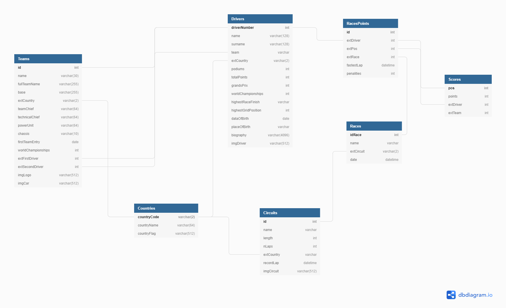

# FORMULA ONE SOLUTION
#### Autore: Chopra Deepak

## Descrizione
La soluzione comprende 3 progetti:
* Progetto Console, in cui ci si occupa della gestione delle operazioni sul database

* Progetto DLL, contenente le varie classi che vengono utilizzate dagli altri progetti
* Progetto WebForm, in cui viene programmata la parte web con l'utilizzo di ASP.net

## Database
Il database contiene le seguenti tabelle:
- Drivers, dove sono salvati i dati dei piloti
- Teams, dove sono salvati i dati delle varie squadre
- Countries, contenente i dati delle varie nazioni
- Circuits, contiene i dati dei circuiti
- Races, memorizza i dati delle gare
- RacePoints, per ogni gara memorizza i punti in base alla posizione
- Score, memorizza i punteggi della stagione

## Realazioni tabelle

- Teams --> Drivers, ogni team ha 2 Drivers mentre 1 driver solo 1 team, quindi abbiamo una relazione (1,2)

- Drivers --> Countries, ogni driver ha ovviamente un'unica nazionalità, quindi c'e un legame relazionale di (1,1)

- Teams --> Countries, anche i team hanno la loro nazionalità, il legame relazionale è (1,1), ad ogni team corrisponde solamente una nazione

- Countries --> Circuits, ogni circuito ha un'uncia nazione mentre una nazione può avere più circuiti, quindi abbiamo una relazione (1,n)

- Races --> Circuits, ogni gara(GP) viene corso su un solo circuito, ma un circuito può ospitare più gare, quindi la relazione è (1,n)

- Races --> RacesPoints, RacesPoints è una tabella intermediaria che viene utilizzata per tenere traccia dei punteggi di ciascuna gara, i punteggi totali invece sono memorizzati all'interno della tabella Scores in base a ciascun driver ordinati per posizione(crescente)

## Software neccesari:
* Visual Studio
* Pacchetti dei vari applicativi, come quello di SqlClient, ASP.net ad esempio

## Team work
> Invece si utilizza la piattaforma Github per poter lavorare anche da casa in gruppo senza alcun problema, visto che offre la possibiltà di creare repository condivise dove ciascuno può effettuare le modifiche necessarie o controllare i progressi fatti. Il nostro è un utilizzo della piattaforma ancora superficiale, visto che abbiamo un repository ciascuno e siamo monitorati dal professore.

## Team sviluppatori:
> 5B Info - Vallauri Fossano Italy